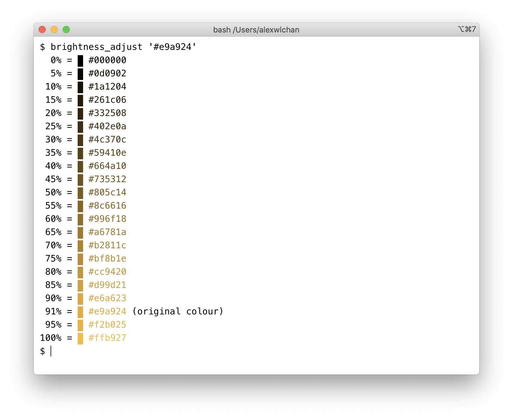

# brightness_adjust

This is a command-line tool to show a selection of darker/lighter variants of a given colour.

I use it when there's a specific hue/saturation I want to use (e.g. chosen by [dominant_colours]), but it's too dark or light to use in a particular context.

For example, in the screenshot above, I have a bright shade of yellow `#e9a924`.
This is too bright to be readable against a white background -- but I have a range of similar colours I can use in its place.

[dominant_colours]: https://github.com/alexwlchan/dominant_colours
